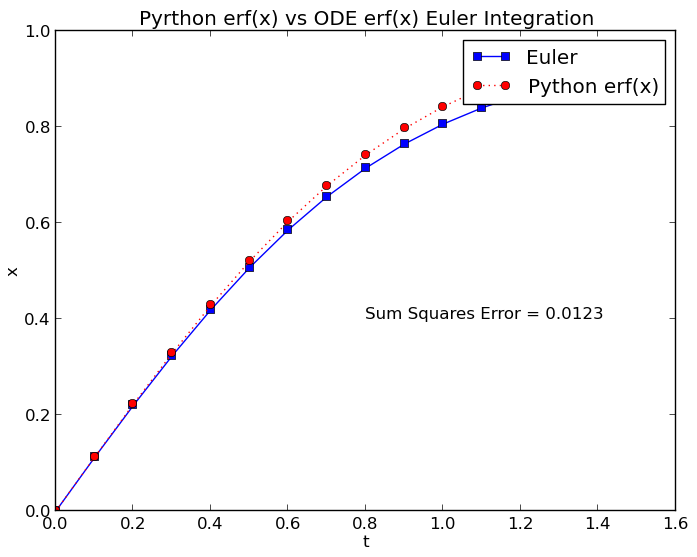
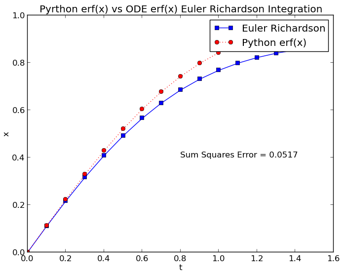
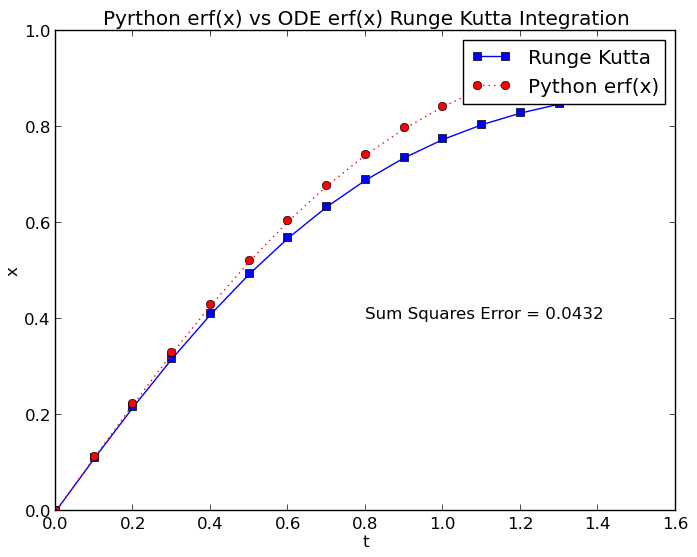
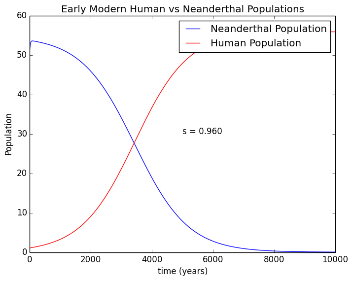

# Homework 1
Refer to [Homework 1](http://wiki.cs.umt.edu/classes/cs477/index.php/Homework_1 "homework 1") 

## Files
  - _problem1.py_ contains all of the code for the first problem.
    - All of the ODE systems associated with the assignment will be in this file. 
  - _problem2.py_ contains all of the code for the second problem. 
    - All of the ODE systems associated with the assignment will be in this file. 
  - _ode.py_ contains all of the ODE integrators.
  - _system.py_ contains the simulator. 
  - _utils.py_ simply contains extra functions. 

## Problem 1
Find the value of the error function using euler, euler-richardson, and rk4. Using the generated ODE error function. Simulate it and then compare it to the python built in error function. Use the sum square error to compare the functions using the different solvers. 

    \textrm{erf}(x)=\frac{2}{\sqrt \pi} \int_0^{x} e^{-x'^2} dx',

### Euler to Simulate the Error Function. 
dt was set to 0.1 sec for this simulation.

### Euler Richard to Simulate the Error Function
dt was set to 0.1 sec for this simulation.

### Runge Kutta to Simulate the Error Function
dt was set to 0.1 sec for this simulation.

## Problem 2
Simulate early Early Modern Man and Neanderthal populations given limited resources. Construct an ODE and solve ti to determine the best parameters that results in a 10,000 year extinction period for the Neanderthals.

    \frac{dN}{dt} = N[A-D(N+E)-B]

    \frac{dE}{dt} = E[A-D(N+E)-sB]

### Resulting Graph
In order to acheive Neanderthal extinction between 5,000 and 1,000 years _s_ needs to be about 0.96.

